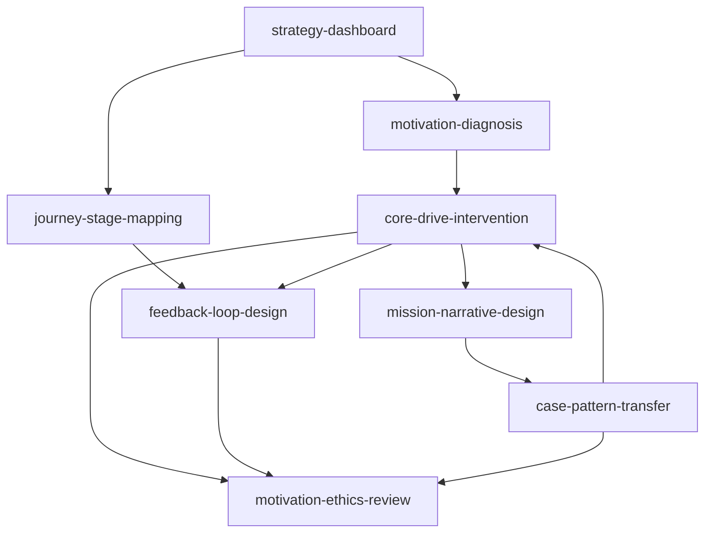

# Octalysis Skill — Index

> Distilled with `book-to-skill` into 8 executable skills and a reusable motivation-design asset library.

## Entry Point

- [`SKILL.md`](./SKILL.md) — router and operating principles.

## Skills

### Diagnosis And Intake

- [`strategy-dashboard`](./skills/strategy-dashboard/SKILL.md) — define success metrics, actors, target behaviors, feedback, rewards, and tradeoffs.
- [`motivation-diagnosis`](./skills/motivation-diagnosis/SKILL.md) — diagnose why a behavior starts, stops, repeats, fails, or becomes unhealthy.

### Design

- [`core-drive-intervention`](./skills/core-drive-intervention/SKILL.md) — translate CD1-CD8 gaps into design interventions.
- [`journey-stage-mapping`](./skills/journey-stage-mapping/SKILL.md) — map Discovery, Onboarding, Scaffolding, and Endgame.
- [`feedback-loop-design`](./skills/feedback-loop-design/SKILL.md) — build self-reinforcing behavior loops.
- [`mission-narrative-design`](./skills/mission-narrative-design/SKILL.md) — create credible meaning, identity, and mission structures.

### Transfer And Guardrails

- [`case-pattern-transfer`](./skills/case-pattern-transfer/SKILL.md) — adapt cases without copying surface mechanics.
- [`motivation-ethics-review`](./skills/motivation-ethics-review/SKILL.md) — review scarcity, randomness, social pressure, streaks, loss, and reward risks.

## Assets

- [`core-drives-library`](./assets/core-drives-library.md)
- [`diagnostic-rules`](./assets/diagnostic-rules.md)
- [`design-process`](./assets/design-process.md)
- [`glossary-and-language-map`](./assets/glossary-and-language-map.md)
- [`case-patterns`](./assets/case-patterns.md)
- [`anti-patterns-and-ethics`](./assets/anti-patterns-and-ethics.md)
- [`output-templates`](./assets/output-templates.md)
- [`source-roles`](./assets/source-roles.md)

## Skill Graph

## Recommended Use Order

1. `strategy-dashboard`
2. `motivation-diagnosis`
3. `journey-stage-mapping`
4. `core-drive-intervention`
5. `feedback-loop-design`
6. `mission-narrative-design` when CD1 is central
7. `case-pattern-transfer` when adapting examples
8. `motivation-ethics-review` for risky mechanisms

## Local-Only Audit Trail

The book-to-skill audit files are intentionally outside this package in the parent workspace under `../books/universal-motivation-architecture/`. They are local distillation work files, not part of the published skill body.
